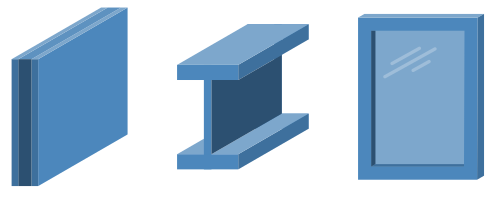

# Material facet

Elements (e.g. walls, doors, windows, etc) in IFC and element types (e.g. wall types, door types, window types, etc) may have a **Material** associated with it. These **Materials** are typically specified as construction materials, as opposed to chemical **Materials**. For example, concrete of two different grades are considered two separate **Materials**.

In the simplest case, an element may have a single **Material**. For example, a chair may be made from a "wood" material. The **Material Facet** lets you filter by elements having this **Material**.

An element may also have multiple **Materials** in three possible scenarios:

- **Layered materials**: an element (e.g. a wall or slab) is parametrically defined in terms of material layers with a thickness (e.g. stud layer, insulation layer, and gypsum layer). Each layer may have a different **Material**.
- **Profiled materials**: an element (e.g. a column or beam) is parametrically defined in terms of a profile (e.g. C-profile, Z-profile, or I-profile) extruded along a path. Composite columns and beams may have multiple profiles from different **Materials**.
- **Constituent materials**: an element (e.g. a window, or slab) where portions of the element are made out of different **Materials** (e.g. the window glazing and the window frame) or mixed  (e.g. a concrete slab may be composed of a percentage of cement, aggregate, etc)

The **Material Facet** lets you filter elements where one of their **Materials** matches your specified **Material**.

Many disciplines, such as costing, scheduling, sustainability analysis, or construction trade packages depend on correct **Material** association. The **Material Facet** is especially useful for domain specific information **Specifications**.

## Parameters

| Parameter | Required | Restrictions Allowed | Allowed Values                                                                                                                                                                                                                                                                       | Meaning                                                                                                                                                                                                                                                 |
| --------- | -------- | -------------------- | ------------------------------------------------------------------------------------------------------------------------------------------------------------------------------------------------------------------------------------------------------------------------------------ | ------------------------------------------------------------------------------------------------------------------------------------------------------------------------------------------------------------------------------------------------------- |
| **Value** | ❌       | ✔️                 | Any material name or material category. The material name is typically specific to the project or local convention. The material category is recommended to be one of 'concrete', 'steel', 'aluminium', 'block', 'brick', 'stone', 'wood', 'glass', 'gypsum', 'plastic', or 'earth'. | The element must be made out of a **Material** with the specified name or category. If there are multiple **Materials**, then any **Material**, **Layer**, **Profile** or **Constituent** with that name or category will also satisfy the requirement. |
| **URI**   | ❌       | ❌                   | Uniform Resource Identifier of the material. The resource should include a name and a definition, and preferably comply with ISO 23386. | One source of valid URIs is [the bSDD](https://search.bsdd.buildingsmart.org/). An example URI for a "Plywood": [https://identifier.buildingsmart.org/uri/cei-bois.org/wood/1.0.0/class/8dca70a2-01a2-489b-9381-fbeff09db8dc](https://identifier.buildingsmart.org/uri/cei-bois.org/wood/1.0.0/class/8dca70a2-01a2-489b-9381-fbeff09db8dc). |

If no parameters are specified, then it means that any **Material** should be present, regardless of name or category.

## Examples

| Applicability Intention                                                                                         | Requirement Intention                                                                                               | Facet Definition            |
| --------------------------------------------------------------------------------------------------------------- | ------------------------------------------------------------------------------------------------------------------- | --------------------------- |
| Any entity with a material                                                                                      | The entity must have a material                                                                                     | No parameters               |
| All entities made from wood                                                                                     | The entity must be made out of wood                                                                                 | Value="wood"                |
| All entities made from brick                                                                                    | The entity must be made out of brick                                                                                | Value="brick"               |
| All entities made from either concrete or steel                                                                 | The entity (e.g. foundation piles) must be made of either concrete or steel                                         | Value=["concrete", "steel"] |
| Any entities with a material named with a code starting with "CON" followed by 2 digits, like CON01, CON02, etc | The entity shall have a material with the naming scheme of "CON" followed by two digits, such as CON01, CON02, etc. | Value="CON[0-9]{2}"         |
