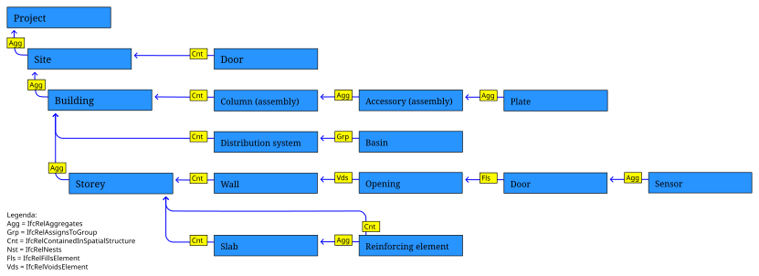

# PartOf facet

This facet either identifies objects that are part-of another (applicability), or require that they are (requirement).

While objects in IFC can have multiple relationships to other objects. IDS part-of recursively navigates the following types to determine if an entity is part-of another:

- The **IFCRELAGGREGATES** relationship describes how multiple smaller sub-objects can be aggregated into a single bigger object. For example, many building storeys make up a building. Alternatively, many beams, floor boards, and joints make up a slab. Or perhaps many brackets, mullions, and steel plates make up an assembly.
- The **IFCRELASSIGNSTOGROUP** relationship describes how multiple objects can be grouped into a collection of objects any use-case. For example, ducts, AHUs, fans, and louvres may all be grouped into a single distribution system.  Alternatively, cables, distribution boards, and GPOs may be grouped into a single circuit. Or perhaps spaces are grouped into zones, or maintainable assets are grouped into an inventory.
- The **IFCRELCONTAINEDINSPATIALSTRUCTURE** relationship describes how multiple objects can be located in a particular location. For example, a pump might be in a space, a column might be on the level 2 building storey, or some street furniture might be on the building site. Every object must have a single primary location container in IFC, even though they may be referenced in multiple locations (such as a multi-storey column). This relationship only targets the primary location container.
- The **IFCRELNESTS** relationship describes how a physical object may be connected to a larger host object, typically through a physical connection such as a pre-drilled hole or connection terminal. When the host moves, the attached nested objects move with it.
- The **IFCRELVOIDSELEMENT** relationship describes how a void belongs to an element.
- The **IFCRELFILLSELEMENT** relationship describes how an element fills a void, making it part of the void.

When the `relation` parameter is not specified, then all 6 are to be considered (recursively) to identify containing entities, otherwise only the specified relation type should be considered (also recursively).

## Parameters

| Parameter    | Required | Restrictions Allowed | Allowed Values                                                  | Meaning                                                                                                                                                                                           |
| ------------ | -------- | -------------------- | --------------------------------------------------------------- | ------------------------------------------------------------------------------------------------------------------------------------------------------------------------------------------------- |
| **Entity**   | ✔️     | ❌                   | Any valid IFC entity (e.g. "IFCSYSTEM")                         | The IFC class of the larger object matches the required entity.                                                                                                                                            |
| **Relation** | ❌       | ✔️                 | One relationship chosen from the 6 supported types listed above | If omitted any valid IFC relationship structure that directly or indirectly, and transitively (recursively) has to be evaluated, if specified only the given type must be evaluated (recursively) |

## Examples

| Applicability Intention                                          | Requirement Intention                                        | Facet Definition                                                |
| ---------------------------------------------------------------- | ------------------------------------------------------------ | --------------------------------------------------------------- |
| Any entity that is directly composing a curtain wall             | The entity (e.g. mullion) must be part of a curtain wall     | Relation="IFCRELAGGREGATES", Entity="IFCCURTAINWALL"            |
| Any entity that is directly or indirectly part of a curtain wall | The entity (e.g. mullion) must be part of a curtain wall     | Entity="IFCCURTAINWALL"                                         |
| Any entity that is part of a distribution system                 | The entity (e.g. duct) must be part of a distribution system | Relation="IFCRELASSIGNSTOGROUP", Entity="IFCDISTRIBUTIONSYSTEM" |
| Any entity that is located in a space                            | The entity (e.g. pump) must be located in a space            | Relation="IFCRELCONTAINEDINSPATIALSTRUCTURE", Entity="IFCSPACE" |
| Any entity that hosted by a hand wash basin                      | The entity (e.g. faucet) must be fixed on a hand wash basin  | Relation="IFCRELNESTS", Entity="IFCSANITARYTERMINAL"            |
| Any window that hosted by a hand wash basin                      | The entity (e.g. faucet) must be fixed on a hand wash basin  | Relation="IFCRELNESTS", Entity="IFCSANITARYTERMINAL"            |                                                              |
